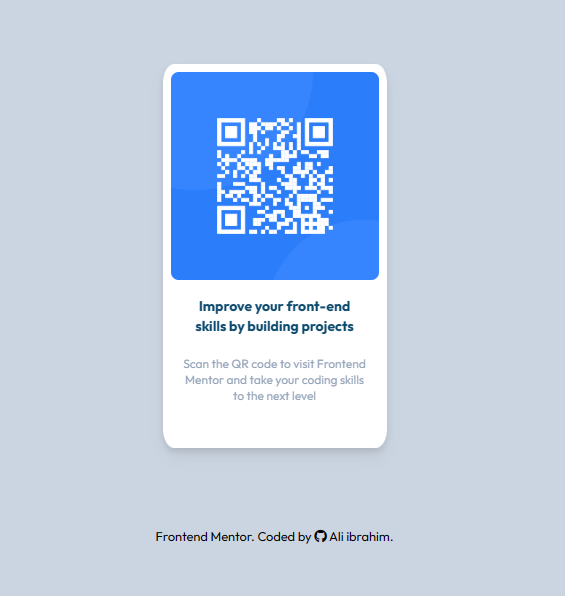

# Frontend Mentor - QR code component solution

This is a solution to the [QR code component challenge on Frontend Mentor](https://www.frontendmentor.io/challenges/qr-code-component-iux_sIO_H). Frontend Mentor challenges help you improve your coding skills by building realistic projects. 

## Table of contents

- [Overview](#overview)
  - [Screenshot](#screenshot)
  - [Links](#links)
- [My process](#my-process)
  - [Built with](#built-with)
  - [What I learned](#what-i-learned)
 
  - [Useful resources](#useful-resources)
- [Author](#author)

## Overview

### Screenshot

   
   

### Links

- Solution URL: https://github.com/bluesky1992-web/qr-code-component-main
- Live Site URL: https://bluesky1992-web.github.io/qr-code-component-main/

## My process

### Built with

- HTML
- TailwindCSS
- Flexbox

### What I learned

i had a chance to practice my TailwindCSS skills 

### Useful resources

- [TailwindCSS Docs](https://tailwindcss.com/) - the documentation very clear and precise and easy use 

## Author

- Website - [Add your name here](https://www.your-site.com)
- Frontend Mentor - [@bluesky1992-web](https://www.frontendmentor.io/profile/bluesky1992-web)
- Twitter - [@AliIbrahimjasi1](https://twitter.com/AliIbrahimjasi1)

